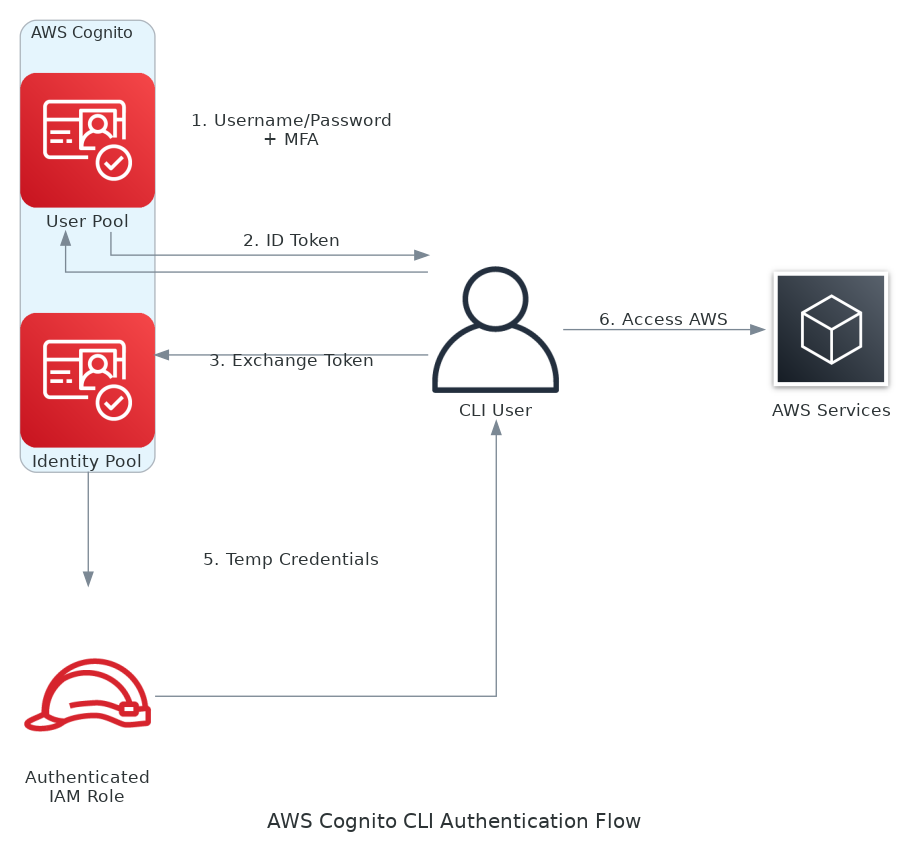

# aws-cognito-cli-login

[](https://www.python.org/downloads/release/python-377/)
[](https://boto3.amazonaws.com/v1/documentation/api/latest/index.html)
[](https://lbesson.mit-license.org/)

A Python CLI tool for authenticating with AWS Cognito and retrieving temporary AWS credentials through Cognito Identity Pool. This tool supports password authentication, MFA setup, and TOTP-based multi-factor authentication.

By default, the tool prompts for username and password interactively. You can also provide credentials as command-line arguments for automation.

**Note:** This tool works only with AWS Cognito **native users** (username/password authentication). It does NOT support federated users from external identity providers (SAML, OIDC, social providers).

## Features

- User authentication with AWS Cognito User Pool
- Support for password change on first login
- TOTP software token MFA setup with QR code generation
- Multi-factor authentication support
- Retrieve temporary AWS credentials via Cognito Identity Pool
- Multiple output formats (shell export, JSON)
- Command-line arguments for automation

## Prerequisites

- Python 3.10+
- AWS Account with Cognito User Pool and Identity Pool configured
- AWS IAM role for authenticated Cognito users
- Cognito native user account (not federated from external IdP)

## Installation

1. Clone the repository:
```bash
git clone https://github.com/yourusername/aws-cognito-cli-login.git
cd aws-cognito-cli-login
```

2. Create and activate a virtual environment (recommended):
```bash
python -m venv .venv
source .venv/bin/activate  # On Windows: .venv\Scripts\activate
```

3. Install dependencies:
```bash
pip install -r requirements.txt
```

4. Create `.env` file with your Cognito configuration:
```bash
COGNITO_URL=cognito-idp.us-east-1.amazonaws.com
COGNITO_USER_POOL_ID=us-east-1_XXXXXXXXX
COGNITO_IDENTITY_POOL_ID=us-east-1:xxxxxxxx-xxxx-xxxx-xxxx-xxxxxxxxxxxx
COGNITO_CLIENT_ID=xxxxxxxxxxxxxxxxxxxxxxxxxx
APP_NAME=MyApp
```

## Usage

### Command-Line Options

```bash
usage: main.py [-h] [-u USERNAME] [-p PASSWORD] [-f {export,json}] [-v] [--change-password]

AWS Cognito CLI Login

options:
  -h, --help            show this help message and exit
  -u USERNAME, --username USERNAME
                        Cognito username
  -p PASSWORD, --password PASSWORD
                        Cognito password
  -f {export,json}, --format {export,json}
                        Output format (default: export)
  -v, --verbose         Verbose output
  --change-password     Change password
```

### Examples

Basic authentication:
```bash
python main.py
```

Specify username and password:
```bash
python main.py -u myusername -p mypassword
```

JSON output format:
```bash
python main.py -u myusername -f json
```

Verbose logging:
```bash
python main.py -u myusername -v
```

Change password:
```bash
python main.py -u myusername --change-password
```

## Deployment

AWS Cognito resources can be deployed using Terraform code in the `terraform/` directory:

```bash
cd terraform
terraform init
terraform plan
terraform apply
```

To customize the deployment:

```bash
terraform apply -var="name=my-cognito-app" -var="region=us-east-1"
```

Attach custom IAM policies to the authenticated role:

```bash
terraform apply -var='authenticated_role_policy_arns=["arn:aws:iam::aws:policy/ReadOnlyAccess"]'
```

After deployment, get the outputs to configure your `.env` file:

```bash
terraform output
```

Terraform outputs:
- `user_pool_endpoint` → `COGNITO_URL`
- `user_pool_id` → `COGNITO_USER_POOL_ID`
- `identity_pool_id` → `COGNITO_IDENTITY_POOL_ID`
- `user_pool_client_id` → `COGNITO_CLIENT_ID`

## How It Works



1. User authenticates with AWS Cognito User Pool using username/password
2. Handles authentication challenges (new password, MFA setup, MFA verification)
3. Receives ID token from successful authentication
4. Exchanges ID token for AWS credentials via AWS Cognito Identity Pool
5. Outputs temporary AWS credentials (Access Key, Secret Key, Session Token)

## References

- Boto3 Amazon Cognito Federated Identities - `CognitoIdentity.Client` [documentation](https://boto3.amazonaws.com/v1/documentation/api/latest/reference/services/cognito-identity.html#cognitoidentity)
- Boto3 Amazon Cognito user pools API `CognitoIdentityProvider.Client` [documentation](https://boto3.amazonaws.com/v1/documentation/api/latest/reference/services/cognito-idp.html#cognitoidentityprovider)
- AWS Cognito - TOTP software token MFA [documentation](https://docs.aws.amazon.com/cognito/latest/developerguide/user-pool-settings-mfa-totp.html)
